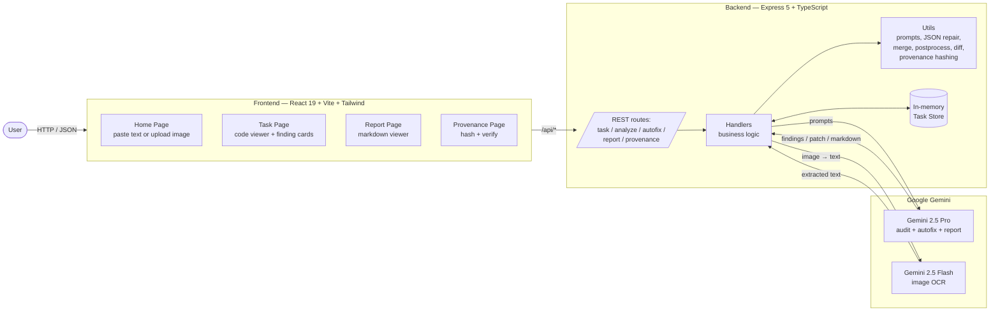

# ConfigGuardian

**AI-powered security auditor for infrastructure configuration files.**

ConfigGuardian helps engineers and platform teams catch security and reliability problems in their configuration files *before* they ship to production. A user pastes a config file (or uploads a screenshot of one), and the system returns a prioritized list of security findings, a one-click "autofix" patch, a downloadable executive-style security report, and a tamper-evident provenance receipt.

---

## What problem does it solve?

DevOps and platform engineers maintain dozens of small but high-risk files: Dockerfiles, Kubernetes manifests, `.env` files, Nginx configs, IAM policies. Misconfigurations in these files are a leading cause of cloud security incidents (exposed secrets, root containers, unpinned images, missing resource limits, etc.).

Today, catching these issues typically requires either:

- A senior security engineer doing a manual review (slow, expensive, doesn't scale), or
- A patchwork of static-analysis CLIs (noisy, hard to triage, no fixes attached).

ConfigGuardian replaces that with a single guided workflow:

1. **Paste or upload** a config file.
2. **AI analysis** returns a deduplicated, severity-ranked list of issues with line numbers, evidence, rationale, and recommendations.
3. **One-click autofix** generates a minimal, production-safe patch shown as a side-by-side diff.
4. **One-click report** generates a polished Markdown security report suitable for leadership or audit.
5. **Provenance** produces a cryptographic receipt (SHA-256 envelope) so anyone can verify the analysis hasn't been tampered with.

---

## Supported file types

| Type | Examples |
|------|----------|
| `dockerfile` | Container build files |
| `k8s` | Kubernetes YAML manifests |
| `env` | `.env` / environment files |
| `nginx` | Nginx server configs |
| `iam` | AWS IAM JSON policies |

---

## Architecture at a glance

> The diagrams below are written in Mermaid (rendered natively by GitHub, GitLab, and most modern Markdown viewers). Static PNG fallbacks live in [`docs/`](./docs) for renderers that don't support Mermaid.




### End-to-end task flow


```mermaid
sequenceDiagram
    autonumber
    actor U as User
    participant FE as Frontend
    participant BE as Backend
    participant G as Gemini

    U->>FE: Paste config or upload image
    FE->>BE: POST /api/task (text | imageBase64, fileType)
    BE-->>FE: taskId (state: INGESTED)

    FE->>BE: POST /api/analyze/:id
    alt Image input
        BE->>G: Vision OCR (gemini-2.5-flash)
        G-->>BE: Raw text
    end
    BE->>G: Audit prompt (gemini-2.5-pro)
    G-->>BE: JSON findings
    BE->>BE: Repair JSON &rarr; validate &rarr; dedupe &rarr;<br/>infer line ranges &rarr; sort &rarr; cap (top 8)
    BE-->>FE: summary + findings (state: PLANNED)

    U->>FE: Click "Autofix"
    FE->>BE: POST /api/autofix/:id
    BE->>G: Generate full patched file (plain text)
    G-->>BE: Patched text
    BE->>BE: Sanitize, strip disallowed lines,<br/>normalize Node base images, build unified diff
    BE-->>FE: diff + patchedText (state: PATCHED)

    U->>FE: Click "Generate Report"
    FE->>BE: POST /api/report/:id
    BE->>G: Report prompt
    G-->>BE: Markdown report
    BE-->>FE: markdown

    U->>FE: Open Provenance
    FE->>BE: POST /api/provenance/:id
    BE-->>FE: Envelope (canonical JSON + SHA-256 hash)
    FE->>BE: POST /api/provenance/verify
    BE-->>FE: ok / recomputed hash
```

---

## How it works (in plain English)

- **Ingest.** The Home page lets a user paste config text *or* upload a screenshot, pick a file type, and submit. The backend creates a Task with a unique ID and stores it.
- **Analyze.** If the input is an image, Gemini Vision OCRs it to plain text first. The text is then sent to Gemini 2.5 Pro under a "senior security auditor" prompt that asks for a structured JSON list of findings across categories like supply-chain, identity & privilege, network exposure, resource governance, secrets, storage, logging, and compliance.
- **Robust parsing.** If the model returns malformed JSON, a "JSON repair" pass coerces it back to a valid shape. Zod then validates the schema; anything that fails validation is dropped gracefully instead of crashing the UI.
- **De-duplicate & rank.** Findings are clustered by evidence so the same root cause isn't reported twice. Each finding gets a clean ID (`CG-DOCK-001`, `CG-K8S-002`, …), an inferred line range, and is sorted by severity (`CRITICAL → LOW`). Results are capped at 8 by default to keep triage manageable.
- **Autofix.** The user can ask the system to fix the issues. Gemini returns the *full final file* as plain text. Several safety guards run before the patch is shown: any structured-patch output is repaired into plain text, "sneaky" additions like new `apt-get` package installs or `LABEL` lines are stripped unless a finding explicitly authorizes them, and Node base images are normalized to a pinned version. A unified diff is computed and shown side-by-side.
- **Report.** A second Gemini call turns the findings into a polished Markdown security report (Executive Summary, Risk Assessment, Detailed Findings, Recommendations, Next Steps). The user can download it.
- **Provenance.** A deterministic, deeply key-sorted JSON envelope of the task is hashed with SHA-256. Anyone can paste the envelope back into the verify endpoint and re-compute the hash to confirm nothing was altered.

---

## Repository layout

```
config-guardian/
├── client/                  React 19 + Vite + Tailwind frontend
│   └── src/
│       ├── app/             App shell, routing
│       ├── pages/           Home, Task, Report
│       ├── components/      CodeViewer, FindingCard, DiffDrawer, Tabs, ...
│       ├── lib/             API client, Zustand store, types, utils
│       └── provenance/      Self-contained provenance UI module
│
└── server/                  Express 5 + TypeScript backend
    ├── server.ts            Bootstraps Express, wires routers, CORS
    ├── routes/              Thin HTTP handlers
    │   ├── tasks.ts         POST /api/task, GET /api/task/:id
    │   ├── analyze.ts       POST /api/analyze/:id
    │   ├── autoFix.ts       POST /api/autofix/:id
    │   ├── report.ts        POST /api/report/:id
    │   └── provenance.ts    POST /api/provenance/:id, /verify
    ├── handlers/            Business logic
    │   ├── taskHandler.ts        Create / fetch tasks
    │   ├── analyzeHandler.ts     OCR + LLM audit pipeline
    │   ├── autofixHandler.ts     Patch generation + safety guards
    │   ├── reportHandler.ts      Markdown report generation
    │   ├── gemini.ts             Google Generative AI wrapper (with timeout)
    │   └── storage.ts            In-memory task store (Map)
    ├── models/              Type and Zod schema definitions
    │   ├── types.ts         AgentTask, FileType, task states
    │   ├── findings.ts      Finding interface
    │   └── schemas.ts       Zod runtime validation
    └── utils/               Pure helpers
        ├── prompts.ts       All Gemini prompt templates
        ├── llmJson.ts       Robust JSON parsing with repair pass
        ├── merge.ts         De-duplicate findings by root cause
        ├── postprocess.ts   Line-range inference, ID normalization, sort/cap
        ├── diff.ts          Unified diff construction (3-line context)
        ├── lines.ts         Regex line-range helper
        └── provenance.ts    Canonical stringify + SHA-256 envelope
```

### Data model

A **Task** is the central unit of work. Its lifecycle states:

`INGESTED → PLANNED (after analyze) → PATCHED (after autofix) → REPORTED / DONE`

A **Finding** has: `id`, `title`, `severity` (LOW | MEDIUM | HIGH | CRITICAL), `evidence`, `rationale`, `recommendation`, optional `lineRange`, optional `autofixHint`, and `source` (`llm`).

---

## Tech stack

**Frontend**
- React 19 + TypeScript
- Vite (dev server + build)
- Tailwind CSS with dark-mode support
- Zustand (state) + React Router 7
- React Markdown, React Diff Viewer Continued
- Lucide React icons, React Hot Toast, qrcode.react

**Backend**
- Node + Express 5 (TypeScript, ESM)
- Google Generative AI SDK
  - `gemini-2.5-pro` for analysis, autofix, and report generation
  - `gemini-2.5-flash` for image OCR
- Zod for runtime schema validation
- `diff` for unified-diff generation
- `multer`, `js-yaml`, `handlebars`, `dotenv`

**Trust & integrity**
- SHA-256 over canonical (deeply key-sorted) JSON envelopes for provenance receipts

---

## Getting started

### Prerequisites
- Node.js 18+
- A Google Gemini API key

### 1. Backend

```bash
cd server
npm install

# create server/.env
cat > .env <<'EOF'
PORT=4000
ALLOWED_ORIGINS=http://localhost:5173
GEMINI_API_KEY=your_key_here
GEMINI_MODEL_ANALYZE=gemini-2.5-pro
GEMINI_MODEL_OCR=gemini-2.5-flash
GEMINI_TIMEOUT_MS=60000
FINDINGS_LIMIT=8
NODE_BASE_VERSION=22.0.0
EOF

npm run dev          # http://localhost:4000  (health: /healthz)
```

### 2. Frontend

```bash
cd client
npm install
npm run dev          # http://localhost:5173
```

Vite proxies `/api/*` to `http://localhost:4000`, so the two services work together out of the box.

---

## API reference

| Method | Endpoint | Purpose |
|--------|----------|---------|
| `POST` | `/api/task` | Create a task from text or `imageBase64` + `fileType` |
| `GET`  | `/api/task/:id` | Fetch task state, findings, patch, etc. |
| `POST` | `/api/analyze/:id` | Run AI security audit; returns findings |
| `POST` | `/api/autofix/:id` | Generate minimal patch + unified diff |
| `POST` | `/api/report/:id` | Generate Markdown security report |
| `POST` | `/api/provenance/:id` | Build SHA-256 envelope for a task |
| `POST` | `/api/provenance/verify` | Recompute hash to verify an envelope |
| `GET`  | `/healthz` | Liveness probe |

---

## Configuration (server `.env`)

| Variable | Default | Purpose |
|----------|---------|---------|
| `PORT` | `4000` | HTTP port |
| `ALLOWED_ORIGINS` | `*` | Comma-separated CORS origins |
| `GEMINI_API_KEY` | *(required)* | Google Generative AI key |
| `GEMINI_MODEL_ANALYZE` | `gemini-2.5-pro` | Model for analyze / autofix / report |
| `GEMINI_MODEL_OCR` | `gemini-2.5-flash` | Vision model for image-to-text |
| `GEMINI_TIMEOUT_MS` | `60000` | Per-request Gemini timeout (ms) |
| `FINDINGS_LIMIT` | `8` | Max findings retained per analysis |
| `NODE_BASE_VERSION` | `22.0.0` | Pin used when normalizing Node base images during autofix |

The frontend optionally reads `VITE_AGENTVERSE_BASE` for deep-linking provenance receipts to Agentverse.

---

## Design decisions worth knowing

- **LLM-only analysis path.** A previous version had hand-written rule checks (see `server/utils/rules.ts`); they're commented out and now serve as documentation. Gemini handles the full audit in one structured prompt for richer, more contextual findings.
- **Robustness over speed.** The pipeline tolerates malformed model output: extract → JSON-repair pass → schema-validate → graceful empty state if any step fails.
- **De-duplication is explicit.** `mergeFindings` clusters by evidence so the same root cause never appears twice, even if the model emits it with different severities or wording.
- **Autofix is intentionally conservative.** The patch generator strips package installs and `LABEL` lines unless a finding explicitly authorizes them, and re-runs with a stricter prompt if the first attempt sneaks them in.
- **Provenance is built-in.** Every analysis can be wrapped in a deterministic, hash-anchored envelope so a recipient can independently verify the report is the one that was issued.
- **In-memory storage is by design (for now).** Tasks live in a `Map` and are lost on restart. Persisting to a database is a clean next step.

---

## Roadmap candidates

- Persistent task storage (Postgres or SQLite)
- GitHub App: open issues / PRs from the report and autofix
- Streaming analysis (server-sent events) for faster perceived performance
- More file types: Terraform, Helm values, CI workflows
- Real signing (Sigstore / cosign) on provenance envelopes
- Auth + multi-tenant workspaces
